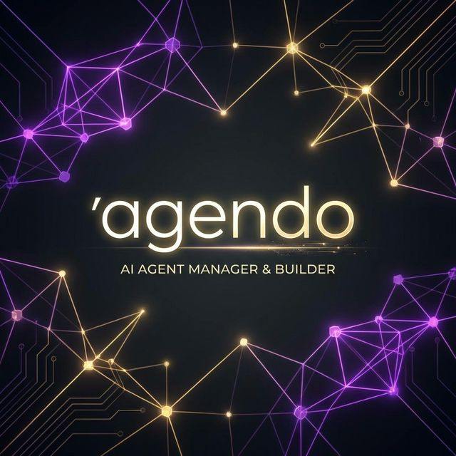

<!-- README HERO BANNER -->
<p align="center">
  
</p>

# agendo

> **The Next-Generation AI Agent Manager, Builder & Execution Orchestrator**

<p align="center">
  
  
  
  
  
</p>

## ✨ Overview

**agendo** is a powerful application designed for discovering, building, and orchestrating advanced AI coding agents (Claude, Codex, Gemini). It delivers live log streaming, bidirectional communication, and robust task management through an intuitive Kanban interface.

With built-in **Model Context Protocol (MCP)** support, agendo allows your agents to initiate tasks autonomously, making it a state-of-the-art framework for autonomous and collaborative AI development.

## 🚀 Key Features

<table>
  <tr>
    <td width="50%">
      <h3>🤖 Multi-Agent Orchestration</h3>
      <p>Seamless management and communication with external AI models (Claude, Codex, Gemini) in real-time.</p>
    </td>
    <td width="50%">
      <h3>📋 Kanban Task Management</h3>
      <p>Organize, track, and monitor agent tasks dynamically with an integrated Kanban board.</p>
    </td>
  </tr>
  <tr>
    <td width="50%">
      <h3>⚡ Real-Time Streaming</h3>
      <p>Server-Sent Events (SSE) and WebSocket integration provide instant live log streaming and bidirectional interactions.</p>
    </td>
    <td width="50%">
      <h3>🔌 First-Class MCP Support</h3>
      <p>Built-in MCP server handling via stdio transports allowing agents to request tools and complete autonomous pipelines.</p>
    </td>
  </tr>
</table>

## 🛠 Tech Stack

Agendo is built on a modern, deeply-integrated stack optimized for real-time AI workloads:

- **Framework**: Next.js 16 (App Router, React 19, TypeScript strict mode)
- **Database & ORM**: PostgreSQL + Drizzle ORM
- **Queue & Async Jobs**: `pg-boss`
- **State Management**: Zustand (Client) & React Server Components (Server)
- **Real-Time Communication**: SSE (for data & logs) + `socket.io` (for terminal interaction)
- **UI Components**: `shadcn/ui` + Tailwind CSS v4
- **Terminal Emulator**: `xterm.js` + `node-pty`

---

## 🚦 Getting Started

### Prerequisites

Ensure you have **Node.js 22+**, **pnpm / npm**, and **PostgreSQL** installed and running on your system.

### Starting the Ecosystem

Agendo uses **PM2** to manage its robust multi-service architecture including the main Next.js app, the worker queue, and the terminal server server.

**Important**: The application development server targets **Port 4100**.

```bash
# Clone the repository
git clone https://github.com/yourusername/agendo.git
cd agendo

# Install dependencies
pnpm install

# Setup Database
pnpm db:generate
pnpm db:migrate

# Start the agent ecosystem using PM2 setup
pm2 restart agent-monitor
```

> **⚠️ CRITICAL**: NEVER run `pnpm dev` directly. Agendo relies on its PM2 ecosystem services (Worker & Terminal Server) to function correctly.

### Available Services (PM2)

| Service         | Port   | PM2 Process Name         | Description                                       |
| --------------- | ------ | ------------------------ | ------------------------------------------------- |
| Next.js App     | `4100` | `agent-monitor`          | Main web interface & API routes                   |
| Queue Worker    | `-`    | `agent-monitor-worker`   | Executes background jobs using `pg-boss`          |
| Terminal Server | `4101` | `agent-monitor-terminal` | Manages node-pty processes and socket connections |

---

## 🧠 Architecture & Principles

Development on agendo follows strict guidelines to ensure scale and maintainability:

1. **Source of Truth Data**: The data model constraints are enforced strictly; types and enums are immutable without rigorous planning.
2. **Type Safety**: Absolute strict mode (`no any` types allowed).
3. **Test-Driven Development (TDD)**: All new features require Red-Green-Refactor cycles starting with failing tests.
4. **Agent Collaboration Workflow**: Test agents build first, implementation agents execute second. Parallel development is minimized.

_For deep architectural details, consult the `planning/` directory._

---

<p align="center">
  Crafted with ❤️ for the future of Autonomous AI Development.
</p>
