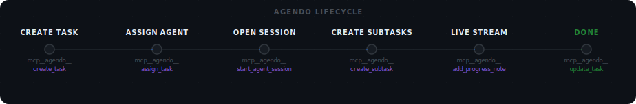
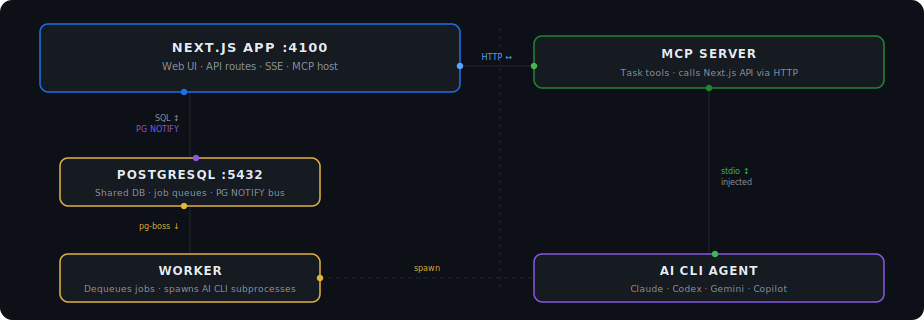

<p align="center">
  
</p>

<h1 align="center">Agendo</h1>

<p align="center">
  <strong>Self-hosted dashboard for managing AI coding agents</strong><br>
  Orchestrate Claude, Codex, and Gemini from a single interface.
</p>

<p align="center">
  
</p>

<p align="center">
  
  
  
  
</p>

<p align="center">
  
  &nbsp;
  
</p>

---

## 30-Second Start

```bash
git clone https://github.com/NehoraiHadad/agendo.git && cd agendo
./scripts/setup.sh --dev
pnpm dev:all  # starts app + worker + terminal
```

Open http://localhost:4100

---

## Features

- **Agent discovery** — auto-detects Claude, Codex, and Gemini CLIs from your PATH
- **Kanban board** — organize work, assign to agents, track progress in real time
- **Live sessions** — bidirectional chat with agents, real-time log streaming
- **Token streaming** — real-time character-level output via `--include-partial-messages`
- **MCP integration** — agents create tasks, report status, and spawn sub-agents autonomously
- **Multi-agent orchestration** — coordinate multiple agents with a live team panel (member list, task assignments, inter-agent messages)
- **Plan mode** — per-agent plan capture (Claude native ExitPlanMode, universal `save_plan` MCP tool)
- **Interactive tools** — AskUserQuestion prompts and ExitPlanMode flow rendered inline in the UI
- **Built-in terminal** — xterm.js + node-pty, directly in the browser
- **PWA** — installable on mobile, push notifications when agents need input

---

## Quick Start

### Prerequisites

| Requirement | Version | Notes                                        |
| ----------- | ------- | -------------------------------------------- |
| Node.js     | 22+     |                                              |
| pnpm        | 10+     | `npm install -g pnpm`                        |
| Docker      | any     | For PostgreSQL (or bring your own PG 15+)    |
| AI CLI      | any     | At least one: `claude`, `codex`, or `gemini` |

### Install

```bash
git clone https://github.com/NehoraiHadad/agendo.git
cd agendo
./scripts/setup.sh
```

The setup script handles everything: dependencies, environment config, JWT secret generation, PostgreSQL, builds, database schema, and agent discovery.

### Start

PM2 keeps services running in the background (recommended):

```bash
npm install -g pm2
cp ecosystem.config.example.js ecosystem.config.js
pm2 start ecosystem.config.js && pm2 save
```

Open **http://localhost:4100**

<details>
<summary>Manual foreground start (without PM2)</summary>

```bash
pnpm start & node dist/worker/index.js &
```

Note: logs from both processes will interleave. Use PM2 for cleaner output.

</details>

### Development Mode

```bash
./scripts/setup.sh --dev
pnpm dev:all                    # app + worker + terminal in one terminal
```

Or run services separately:

```bash
pnpm dev          # Next.js (port 4100)
pnpm worker:dev   # Worker with hot-reload
pnpm terminal:dev # Terminal server (port 4101, optional)
```

---

## Agent CLI Setup

Agendo discovers agents from your PATH automatically during setup. Install the ones you want:

```bash
# Claude (Anthropic)
npm install -g @anthropic-ai/claude-code
claude auth login

# Codex (OpenAI)
npm install -g @openai/codex
codex login

# Gemini (Google)
npm install -g @google/gemini-cli
gemini auth login
```

Run `pnpm db:seed` after installing new CLIs to register them.

---

## Architecture

<p align="center">
  
</p>

| Service  | Default Port | Description                                   |
| -------- | ------------ | --------------------------------------------- |
| App      | 4100         | Web UI, API routes, SSE endpoints             |
| Worker   | ---          | Job queue processor, agent subprocess manager |
| Terminal | 4101         | xterm.js + node-pty over WebSocket (optional) |

---

## Environment

Copy `.env.example` to `.env.local` (the setup script does this automatically).

| Variable       | Required | Description                                   |
| -------------- | -------- | --------------------------------------------- |
| `DATABASE_URL` | Yes      | PostgreSQL connection string                  |
| `JWT_SECRET`   | Yes      | Min 16 chars (auto-generated by setup script) |
| `PORT`         | No       | App port (default: 4100)                      |
| `LOG_DIR`      | No       | Session log directory (default: `./logs`)     |

See `.env.example` for the full list with defaults.

---

## Scripts

```bash
# Setup
./scripts/setup.sh           # Full setup (build + DB + seed)
./scripts/setup.sh --dev     # Dev setup (DB + seed, skip build)

# Build
pnpm build:all               # App + worker + MCP server

# Database
pnpm db:setup                # Create schema (drizzle-kit push)
pnpm db:seed                 # Seed config + discover agents
pnpm db:studio               # Drizzle Studio web UI

# Quality
pnpm lint                    # ESLint (zero warnings)
pnpm typecheck               # TypeScript strict
pnpm test                    # Vitest
```

---

## Remote Access

Install [Tailscale](https://tailscale.com) on your server and client devices. Agendo becomes available at `http://<machine-name>:4100` over your private network. No reverse proxy or SSL configuration needed.

### Windows

Agendo requires a Unix-like environment. On Windows, use WSL 2:

1. Install WSL 2: `wsl --install` (PowerShell admin)
2. Open your WSL terminal (Ubuntu recommended)
3. Install Node.js 22+ and pnpm inside WSL
4. Follow the Quick Start above (inside WSL)

Docker Desktop must have WSL 2 integration enabled for PostgreSQL.

---

## Tech Stack

| Layer       | Technology                                   |
| ----------- | -------------------------------------------- |
| Framework   | Next.js 16, React 19, TypeScript strict      |
| Database    | PostgreSQL + Drizzle ORM                     |
| Queue       | pg-boss v10                                  |
| UI          | shadcn/ui + Tailwind CSS v4                  |
| State       | Zustand (client), Server Components (server) |
| Real-time   | SSE + PG NOTIFY                              |
| Terminal    | xterm.js v6 + node-pty + ws                  |
| MCP         | @modelcontextprotocol/sdk (stdio)            |
| Drag & Drop | @dnd-kit                                     |

---

## Project Structure

```
src/
  app/                 Next.js App Router (pages, API routes, SSE)
  components/          React components (sessions, kanban, terminal)
  hooks/               Custom React hooks
  lib/
    db/                Drizzle schema + seed
    discovery/         Agent auto-discovery
    mcp/               MCP server + config templates
    services/          Business logic
    worker/
      adapters/        Claude, Codex, Gemini protocol adapters
  terminal/            Terminal server (WebSocket + node-pty)
scripts/               Setup, safe restart, utilities
```

---

## Contributing

1. Fork the repo, clone, and run `./scripts/setup.sh --dev`
2. Create a feature branch: `git checkout -b feat/my-feature`
3. Make changes — lint and type-check pass: `pnpm lint && pnpm typecheck`
4. Run tests: `pnpm test`
5. Open a PR against `main`

See CLAUDE.md for architecture details, coding conventions, and the TDD workflow.

---

## License

MIT
