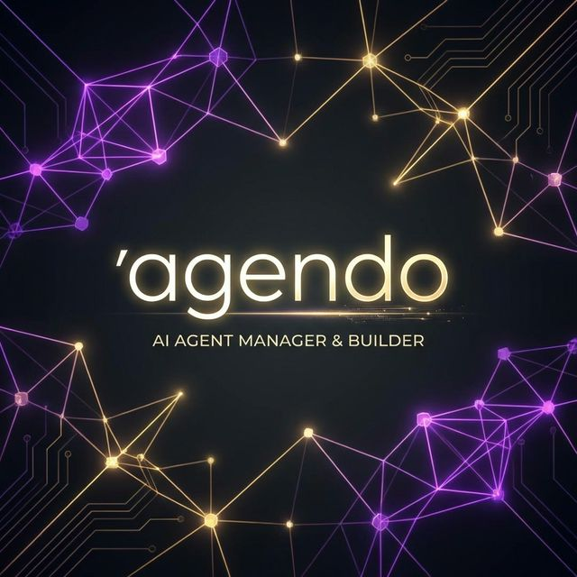
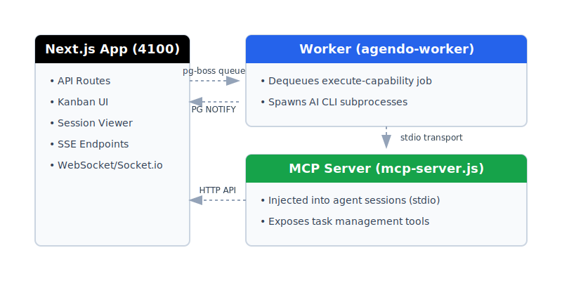
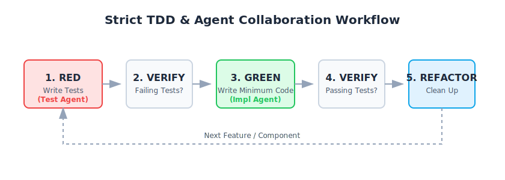

<!-- README HERO BANNER -->
<p align="center">
  
</p>

# agendo

> **The Next-Generation AI Agent Manager, Builder & Execution Orchestrator**

<p align="center">
  
  
  
  
  
</p>

---

## 📸 Interface Preview

<div align="center">
  
  
  <p><em>Agendo features a fully responsive, modern UI built with Next.js and Tailwind CSS.</em></p>
</div>

---

## ✨ Overview

**agendo** is a powerful application designed for discovering, building, and orchestrating advanced AI coding agents (Claude, Codex, Gemini). It delivers live log streaming, bidirectional communication, and robust task management through an intuitive Kanban interface.

With built-in **Model Context Protocol (MCP)** support, agendo allows your agents to initiate tasks autonomously, making it a state-of-the-art framework for autonomous and collaborative AI development.

## 🚀 Key Features

<table>
  <tr>
    <td width="50%">
      <h3>🤖 Multi-Agent Orchestration</h3>
      <p>Seamless management and communication with external AI models (Claude, Codex, Gemini) in real-time. Coordinate multiple agents across complex codebases.</p>
    </td>
    <td width="50%">
      <h3>📋 Kanban Task Management</h3>
      <p>Organize, track, and monitor agent tasks dynamically with an integrated Kanban board. Move tasks seamlessly from backlog to execution.</p>
    </td>
  </tr>
  <tr>
    <td width="50%">
      <h3>⚡ Real-Time Streaming</h3>
      <p>Server-Sent Events (SSE) and WebSocket integration provide instant live log streaming and bidirectional interactions directly in the UI.</p>
    </td>
    <td width="50%">
      <h3>🔌 First-Class MCP Support</h3>
      <p>Built-in MCP server handling via stdio transports allowing agents to request tools, read files, and complete autonomous pipelines securely.</p>
    </td>
  </tr>
</table>

## 🛠 Tech Stack

Agendo is built on a modern, deeply-integrated stack optimized for real-time AI workloads:

- **Framework**: Next.js 16 (App Router, React 19, TypeScript strict mode)
- **Database & ORM**: PostgreSQL + Drizzle ORM
- **Queue & Async Jobs**: `pg-boss`
- **State Management**: Zustand (Client) & React Server Components (Server)
- **Real-Time Communication**: SSE (for data & logs) + `socket.io` (for terminal interaction)
- **UI Components**: `shadcn/ui` + Tailwind CSS v4
- **Terminal Emulator**: `xterm.js` + `node-pty`

---

## 🚦 Getting Started

### Prerequisites

Ensure you have **Node.js 22+**, **pnpm / npm**, and **PostgreSQL** installed and running on your system.

### Starting the Ecosystem

Agendo uses **PM2** to manage its robust multi-service architecture including the main Next.js app, the worker queue, and the terminal server.

**Important**: The application development server targets **Port 4100**.

```bash
# Clone the repository
git clone https://github.com/yourusername/agendo.git
cd agendo

# Install dependencies
pnpm install

# Setup Database
pnpm db:generate
pnpm db:migrate

# Start the agent ecosystem using PM2 setup
pm2 restart agent-monitor
```

> **⚠️ CRITICAL**: NEVER run `pnpm dev` directly. Agendo relies on its PM2 ecosystem services (Worker & Terminal Server) to function correctly.

### Available Services (PM2)

| Service         | Port   | PM2 Process Name         | Description                                       |
| --------------- | ------ | ------------------------ | ------------------------------------------------- |
| Next.js App     | `4100` | `agent-monitor`          | Main web interface & API routes                   |
| Queue Worker    | `-`    | `agent-monitor-worker`   | Executes background jobs using `pg-boss`          |
| Terminal Server | `4101` | `agent-monitor-terminal` | Manages node-pty processes and socket connections |

---

## 🧠 Architecture & Workflow

### Multi-Process Architecture

Agendo is built on a robust three-process architecture to ensure stability, responsiveness, and secure agent execution:

<p align="center">
  
</p>

- **Next.js App (4100)**: Serves the Kanban UI, API routes, and manages real-time EventSource (SSE) connections with the client.
- **Worker Process**: Subscribes to `pg-boss` queues, securely spawns AI CLI subprocesses, and streams real-time updates back via PG NOTIFY.
- **MCP Server**: Injects the Model Context Protocol into agent sessions via `stdio`, allowing agents native task management capabilities within their isolated environments.

### 🔄 Strict TDD & Agent Collaboration

Development on agendo follows strict guidelines to ensure scale and maintainability:

1. **Source of Truth Data**: The data model constraints are enforced strictly; types and enums are immutable without rigorous planning.
2. **Type Safety**: Absolute strict mode (`no any` types allowed).

We enforce a firm **Test-Driven Development (TDD)** cycle paired with an **Agent Collaboration Workflow**:

<p align="center">
  
</p>

- **Test Agents** are deployed first to write strictly failing tests based on the agreed-upon interface (RED).
- **Implementation Agents** are deployed second to write the minimal code required to make tests pass (GREEN).
- **Parallel development is minimized** to avoid stepping on state. Every feature requires this Red-Green-Refactor cycle.

_For deep architectural details, consult the `planning/` directory._

---

<p align="center">
  Crafted with ❤️ for the future of Autonomous AI Development.
</p>
